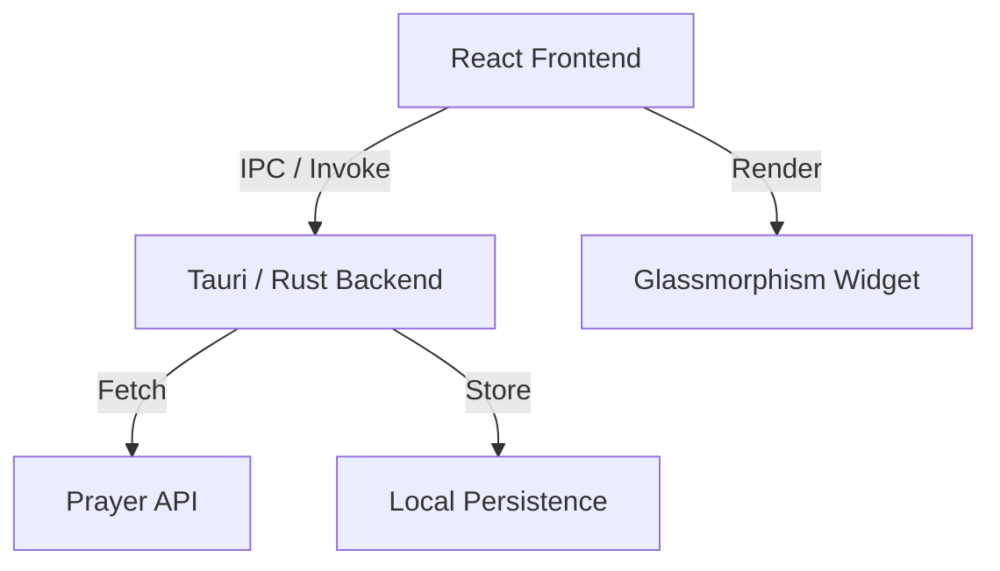

# ✨ Salah Tracker: Modern Prayer Widget

A high-performance, minimalist desktop widget for tracking prayer times. Rebuilt from the ground up using **Tauri v2**, **Rust**, and **React 19** for maximum efficiency and a premium feel.

<p align="center">
  
</p>

---

## 💎 Core Pillars

- **🚀 Performance-First**: Powered by a Rust backend with near-zero memory footprint.
- **🎨 Glassmorphism Design**: A sleek, transparent, and modern UI that lives elegantly on your desktop.
- **⚡ Instant Feedback**: Sub-second startup times and smooth animations (driven by Framer-like transitions).
- **📦 Zero Configuration**: Smart auto-location detection gets you started in seconds.

---

## 🌟 Key Features

| Feature | Description |
| :--- | :--- |
| **🌍 Auto-Location** | Automatically detects your current city and fetches accurate prayer timings. |
| **📍 Multi-City Support** | Save your favorite cities and switch between them instantly. |
| **⏳ Real-Time Countdown** | Live countdown to the next prayer, keeping you prepared. |
| **💨 Minimalist Footprint** | Extremely lightweight on resources compared to Electron-based alternatives. |
| **💾 Persistent Caching** | Local caching ensures the app works offline and starts up instantly. |
| **🖥️ Widget Mode** | Transparent background, skipped taskbar, and always-available presence. |
| **🔁 Autostart** | Automatically launches with your system so your schedule is always synced. |

---

## 🛠️ Technology Stack

- **Frontend**: [React 19](https://react.dev/), [Vite](https://vitejs.dev/), [TypeScript](https://www.typescriptlang.org/)
- **Backend/Native**: [Tauri v2](https://v2.tauri.app/), [Rust](https://www.rust-lang.org/)
- **Styling**: Vanilla CSS (Modern Custom Properties)
- **Icons**: [Lucide React](https://lucide.dev/)
- **Plugins**: [Autostart Plugin](https://github.com/tauri-apps/plugins-workspace/tree/v2/plugins/autostart)

---

## 🚀 Getting Started

### Platform Prerequisites

Before starting, ensure you have the core tools installed for your Operating System.

| OS | Required Development Tools |
| :--- | :--- |
| **🪟 Windows** | [Visual Studio Build Tools](https://visualstudio.microsoft.com/visual-cpp-build-tools/) (C++ support) & [WebView2](https://developer.microsoft.com/microsoft-edge/webview2/) |
| **🍎 macOS** | [Xcode Command Line Tools](https://developer.apple.com/xcode/) (`xcode-select --install`) |
| **🐧 Linux** | System libraries (e.g., `libwebkit2gtk-4.1`, `build-essential`, `libappindicator3-dev`). See [Tauri Linux Guide](https://v2.tauri.app/start/prerequisites/#linux) |

**All Platforms**: Require [Node.js](https://nodejs.org/) (v18+) and [Rust](https://rustup.rs/).


### Development
1. **Clone the project**:
   ```bash
   git clone <repository-url>
   cd Salah-Tracker
   ```

2. **Install dependencies**:
   ```bash
   npm install
   ```

3. **Run in development mode**:
   ```bash
   npm run tauri dev
   ```

---

## 🏗️ Project Architecture



- **`src-tauri/`**: Rust core. Handles system-level operations, API calls, and native window management.
- **`src/`**: React application. Manages UI state, countdown logic, and interactive components.

---

## 📦 Packaging & Installation (Production)

To create a standalone installer for your current platform, run:

```bash
npm run tauri build
```

### Installation by Platform

Once the build is complete, your installer can be found in `src-tauri/target/release/bundle/`.

#### **Windows**
- **Artifact**: `.exe` (NSIS Installer) or `.msi`
- **Installation**: Run the generated executable and follow the setup wizard. The app will be added to your Start Menu.

#### **macOS**
- **Artifact**: `.app` or `.dmg`
- **Installation**: Open the `.dmg` and drag **Salah Tracker** into your **Applications** folder.

#### **Linux**
- **Artifact**: `.deb` (Debian/Ubuntu) or `.rpm` (Fedora) or `AppImage`
- **Installation**:
  - **Debian**: `sudo dpkg -i salah-tracker_xxx_amd64.deb`
  - **AppImage**: Right-click, select "Make Executable", and run.


---

## 📜 License
This project is licensed under the **MIT License**.
